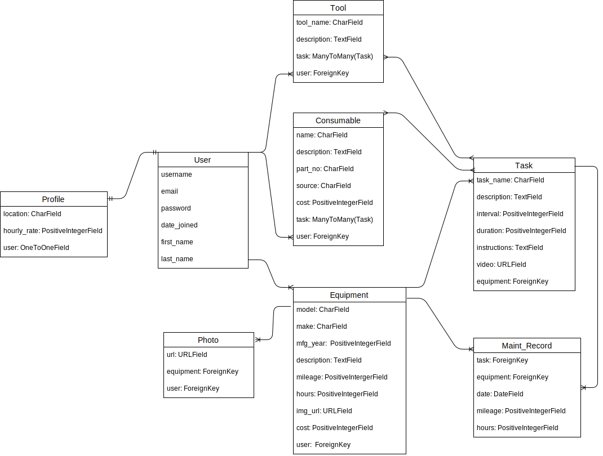

# Country-Mechanic
App to track maintenance of equipment used on hobby farms and rural homesteads.

## App location
https://country-mechanic.herokuapp.com/

# Concept
Rural living requires a large and diverse collection of equipment that needs maintenace to stay safe and effective.  Equipment includes cars, trucks, ATVs, and tractors, as well as tools with small engines like chainsaws and brush hogs.  For some equipment, maintenance is performed on a schedule, for others the maintenance is based on the hours of use or mileage and can therefore have inconsistent periods between maintenance activities.  In both of these cases it can be hard to remember all of the maintenance required or the steps required to perform the maintenance.  This is where Country Mechanic will come in.  The app will have a garage that stores all of the equipment that requires maintenance.  When a piece of equipment is selected from the garage the maintenance record, upcoming tasks, equipment informtion, and required consumables can be viewed.   

# User Story
The user will start on a home page where they can see information about Country Mechanic and choose to signup or login.  If it is the users first time on the site they can signup.  The signup will be a modal that collects user information.  Once user information is filled in and submitted the user will be taken to the Garage page of the website.  The Garage page contains a viewing area for all of the owned pieces of equipment.

A returning user will be able to login from the home page and will be taken to the Garage page.

At the bottom of the garage is a button to add more equipment.  Clicking this button will take the user to the add equipment form, see wireframes for a preview of the equipment form.  Once new equipment is added it will be viewable in garage.

On first login the garage page will ask the user to add a piece of equipment to start the garage. 

The user can click on any piece of equipment in the Garage.  Once clicked, the user is taken to the equipment show page.  On the show page is info about the equipment, including a picture is one has been uploaded, and info about the equipment maintanance.  Below the equipment information are tabs that show information about Maintenance Records, Upcoming Tasks, Consumables, Tasks, and Tools.  Clicking a tab change the viewing area to reflect the data linked to by the tab.   Maintenance records, Upcoming tasks, tools, and consumables will be read only.  

The user can add tasks for the equipment currently being shown.  Tasks allow tools and consumables to be added.  

Tools and consumables are created from thier own index pages.  After a tool or consumable is created the user will be returned to the page from which they left to create the tool or consumable.  

# Technologies
- Django
- PostgreSQL
- Boto3
- Amazon S3
- Jquery
- Semantic UI
- HTML
- CSS

# Installation
 - Prepare local machine
    - make a directory using the mkdir command
    - create a virtual environment: `python3 -m venv .env`
    - activate the environment: `source .env/bin/activate`
 - Clone application into the previously created directory
 - Install dependencies:  `pip3 install -r requirements.txt`
 - Run the server: `python3 manage.py runserver`
 - Verify that the server is running by browsing to localhost:8000.  The home page for country mechanic should be visible
 - Create a database on local machine
 - Add the database to settings.py
 - Migrate models to the database: `python3 manage.py migrate`
 - Create a superuser: `python3 manage.py createsuperuser`

 # Wireframes
 [Wireframes](/planning_docs/Wireframes.png)

 # ERD
 

